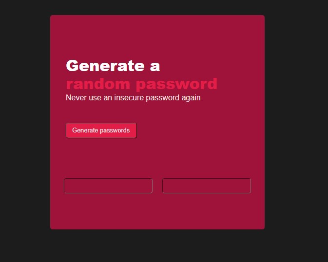

README

Introduction

This is a JavaScript code snippet for generating random passwords and implementing a copy-on-click feature. The code creates two randomly generated passwords of 16 characters each, using a character set that includes uppercase and lowercase letters, numbers, and special characters.
 click on generate password to get a random password generated.
 

[See live version](https://myrandompasswordgen.netlify.app/)

Prerequisites

This code requires basic knowledge of HTML, CSS, and JavaScript. It can be run on any modern web browser.
Installation and Usage

    Create a new HTML file.
    Add the HTML structure and include the CSS and JavaScript files in the head section.
    Copy and paste the JavaScript code into a new file and save it as a .js file.
    Add the necessary HTML elements, including a button element with the id 'btn-el', and two input elements with the ids 'displayPassword-el' and 'displayPassword2-el'.
    Open the HTML file in a web browser and click the button to generate two random passwords.

Implementation Details

The code begins by creating an array of characters that will be used to generate the passwords. The 'btn-el' element and the two password input elements are then retrieved from the DOM using the document.getElementById() method.

An event listener is added to the 'btn-el' element to generate two random passwords, each of 16 characters, using a loop that randomly selects characters from the character array. The generated passwords are then displayed in the password input elements.

Two additional event listeners are added to each password input element to implement a copy-on-click feature. When a user clicks on the input element, the password is selected and copied to the clipboard using the document.execCommand('copy') method.

Finally, the code includes some basic CSS styles to create a simple user interface for the password generator.
Credits

